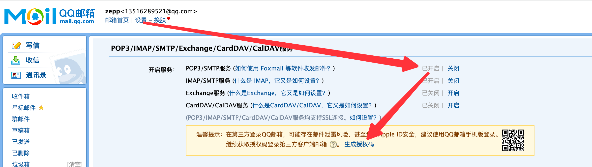
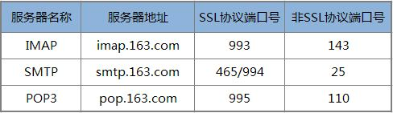

# 如何发送邮件

数据处理完成后，我们可以邮件通知业务方。  


使用场景示例：

- 数据计算处理后，生成下载链接，发邮件给相关人员
- 数据量较少的情况，可以直接发送数据处理结果


发送邮件使用 run 语法，我们目前支持2种方式，分别如下：

- local: 连接本地 sendmail 服务器的方式。需要用户在本地服务器部署 sendmail 服务，并配置好用户名、授权码等信息，在MLSQL中会连接本地服务发送邮件。通过 sendmail 服务我们可以灵活的选择 MDA（邮件投递代理）或者 MTA（邮件服务器）来处理邮件。                           
- config: 配置 SMTP 服务器的方式。在 MLSQL 中配置邮箱用户名和邮箱授权码、邮箱 SMTP 服务器地址、端口，通过授权码登录第三方客户端邮箱。如果使用个人或者企业邮箱推荐使用该方式。


## 如何使用

### 代码示例

下面看一个 config 方式的代码示例：

```sql
set EMAIL_TITLE = "这是邮件标题";
set EMAIL_BODY = "MLSQL 任务 xx 运行完成，请及时查询结果";
set EMAIL_TO = "137297351@qq.com,lisheng_zhanglin@163.com";

-- 使用配置账号的方式
run command as SendMessage.``
where method = "mail"
and from = "137297351@qq.com"
and to = "${EMAIL_TO}"
and subject = "${EMAIL_TITLE}"
and content = "${EMAIL_BODY}"
and smtpHost = "smtp.qq.com"
and smtpPort = "587"
and userName = "137297351@qq.com"
and password="---"
;
```

我们支持使用本地邮件服务的方式，方式如下：

```sql
run command as SendMessage.``
where method = "mail"
and mailType="local"
and content = "${EMAIL_BODY}"
and from = "137297351@qq.com"
and to = "${EMAIL_TO}"
and subject = "${EMAIL_TITLE}"
;
```

下面介绍一下如何使用邮件发送HTML格式的文本，并携带附件。

1） 首先通过 MLSQL Api Console 上传2个CSV文件`employee.csv`和`company.csv`，作为附件内容。

2） 通过如下SQL的方式发送该邮件，示例如下：

```sql
set EMAIL_TITLE = "这是邮件标题";
set EMAIL_BODY = '''<div>这是第一行</div><br/><hr/><div>这是第二行</div>''';
set EMAIL_TO = "137297351@qq.com";

run command as SendMessage.``
where method="mail"
and content="${EMAIL_BODY}"
and from = "137297351@qq.com"
and to = "${EMAIL_TO}"
and subject = "${EMAIL_TITLE}"
and contentType="text/html"
and attachmentContentType="text/csv"
and attachmentPaths="/tmp/employee.csv,/tmp/employee.csv"
and smtpHost = "smtp.qq.com"
and smtpPort="587"
and `userName`="137297351@qq.com"
and password="---"
;
```

### 配置参数

> 红色字体参数为必填项。

| 参数名  |  参数含义 |
|---|---|
| method | 消息发送方式，目前支持：MAIL（邮件发送）；默认值为MAIL |
| mailType | 邮件服务类型，目前支持：local（使用本地sendmail服务）、config（sql配置SMTP服务器）；默认值为local |
| userName | 邮箱服务用户名，即邮箱账号，如：do_not_reply@gmail.com；如果为config模式该值必填。 |
| password | 邮箱服务授权码；如果为config模式该值必填。 |
| <font color='red'> from </font> | 发件人邮箱账户 |
| <font color='red'> to </font> | 收件人邮箱账户，多个账户使用','分隔 |
| cc | 抄送人邮箱账户，多个账户使用','分隔 |
| subject | 邮件标题 |
| content | 邮件内容 |
| contentType | 邮件内容的格式，目前支持标准的Java Mail Content-Type，如：text/plain、text/html、text/csv、image/jpeg、application/octet-stream、multipart/mixed |
| attachmentContentType | 邮件附件内容的格式，目前支持标准的Java Mail Content-Type |
| attachmentPaths | 邮件附件地址，多个地址使用','分隔 |
| smtpHost | SMTP邮件服务域名；如果为config模式该值必填。 |
| smtpPort | SMTP邮件服务端口号；如果为config模式该值必填。 |


### Q&A

#### 1. config 模式是使用什么方式发送邮件

在 MLSQL config 模式中，使用的邮件用户代理（ Mail User Agent, 简称 MUA ）客户端程序是 JavaMail-API。

#### 2. 为什么需要邮箱授权码（password）

使用客户端连接邮箱 SMTP 服务器时，可能存在邮件泄露风险，甚至危害操作系统的安全，大部分邮件服务都采用 SSL 协议的加密方式，需要我们提供授权码验证用户身份，用于登录第三方客户端邮箱发送邮件。

#### 3. 如何获取邮箱授权码（password）

不同邮箱获取授权码的方式不同，我们以`QQ邮箱`为例，首先访问 `设置 - 账户 - POP3/IMAP/SMTP/Exchange/CardDAV/CalDAV服务`，然后找到下图所示的菜单，开启 POP3/SMTP 服务，并点击`生成授权码`。



#### 4. 如何获取 smtpHost、smtpPort

不同邮箱获取授权码的方式不同，我们可以很容易在用户手册中找到邮箱提供的SMTP服务器，以QQ邮箱为例，QQ邮箱 POP3 和 SMTP 服务器地址设置如下：

| 邮箱   | POP3服务器（端口995） | SMTP服务器（端口587） |
| ------ | --------------------- | --------------------- |
| qq.com | pop.qq.com            | smtp.qq.com           |

如果使用的是163邮箱，则相关服务器信息：

